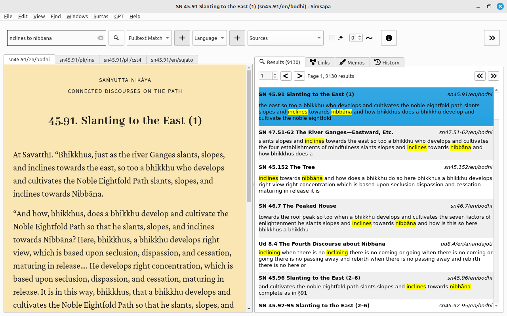
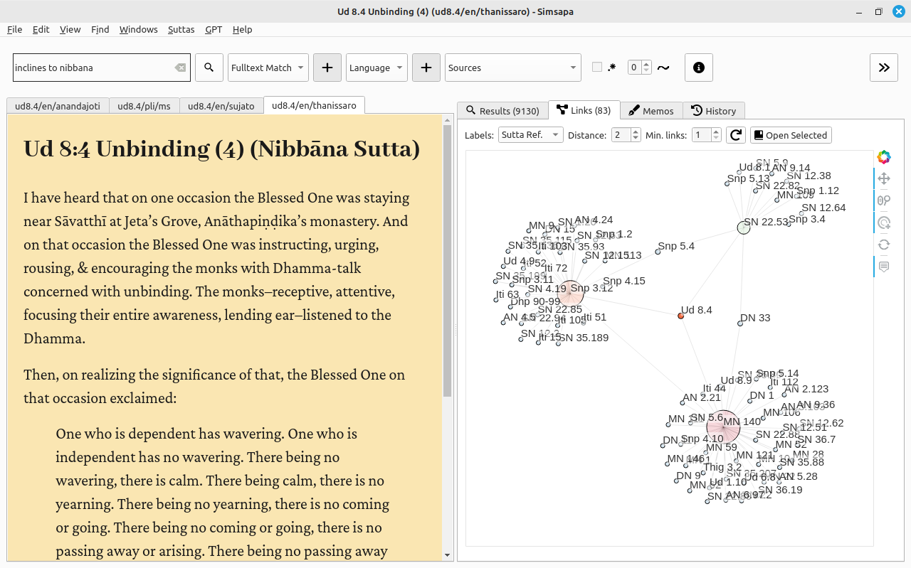
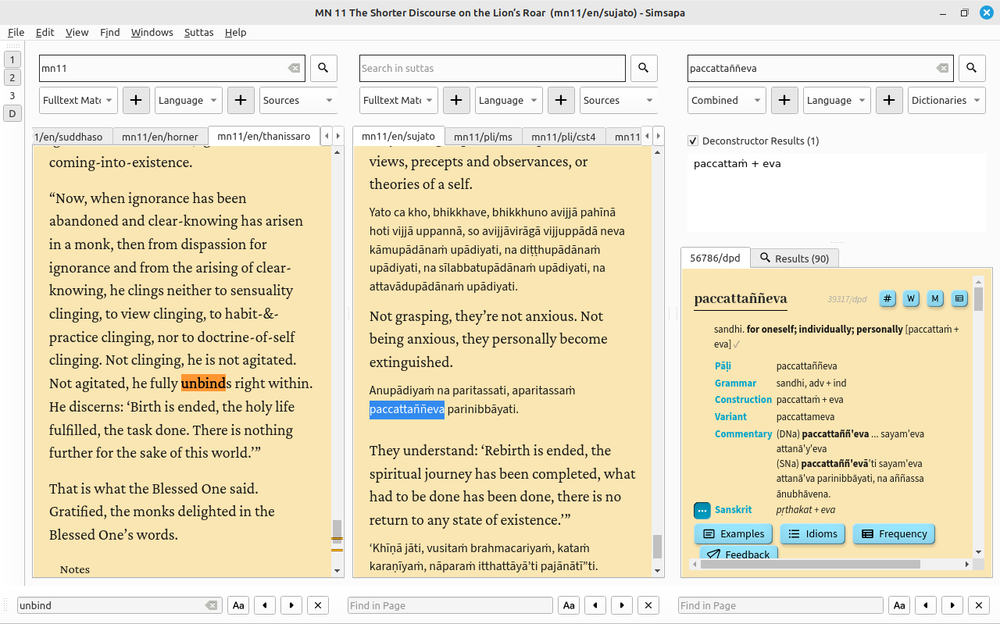

# Simsapa Dhamma Reader

A sutta reader and Pali dictionary application.

Download the latest build from [Releases](https://github.com/simsapa/simsapa/releases/). On the first run, it downloads the application database and fulltext index.

After the database download, the application can operate offline.

A laptop with 8 GB RAM is sufficient to run Simsapa, see also [Low Memory Mode](troubleshooting/low-memory-mode.md) and how to minimize memory usage.

Installation guides: [MacOS](install/macos.md) / [Windows](install/windows.md) / [Linux](install/linux.md) / [from Source](development/running-from-source.md).

A short feature demo:

<iframe width="750" height="420" src="https://www.youtube.com/embed/Wu4T_CANnns" title="Simsapa Dhamma Reader: Feature Demo (v0.3.2-alpha.1)" frameborder="0" allow="accelerometer; autoplay; clipboard-write; encrypted-media; gyroscope; picture-in-picture; web-share" allowfullscreen></iframe>

