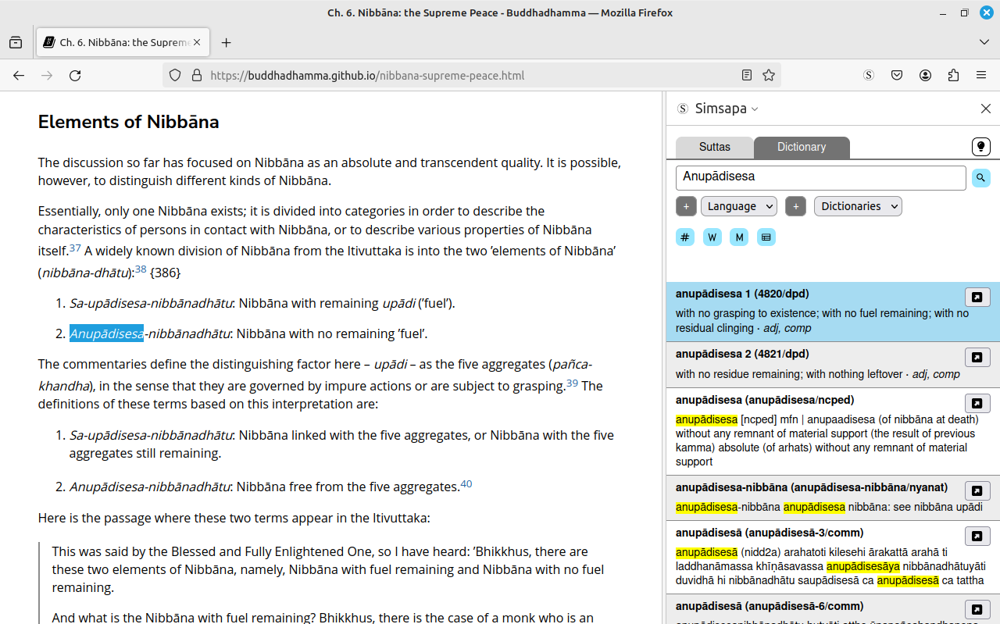
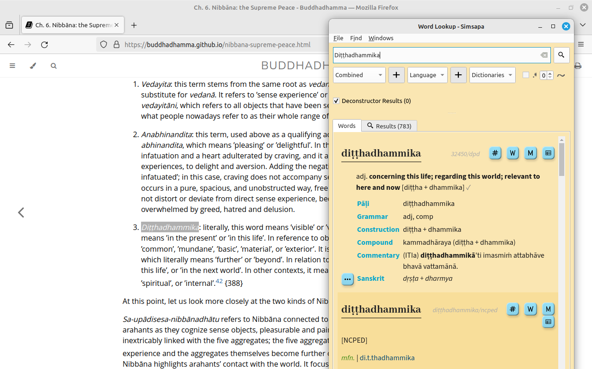

# Browser and Editor Plugins

Github: [simsapa/simsapa-extensions-and-plugins](https://github.com/simsapa/simsapa-extensions-and-plugins)

- [Firefox](https://addons.mozilla.org/en-US/firefox/addon/simsapa/)
- Chrome:
    - Install from the .zip file for the time being (see the [steps below](#install-the-chrome-plugin))
- [Obsidian](https://obsidian.md/)
    - Install from Obsidian: Settings > Community Plugins > Browse
    - Repo: [simsapa-obsidian](https://github.com/simsapa/simsapa-obsidian)
- [Joplin](https://joplinapp.org/plugins/plugin/io.github.simsapa/)
    - Install from Joplin: Tools > Options > Plugins
    - Repo: [simsapa-joplin](https://github.com/simsapa/simsapa-joplin)
- [Emacs package](https://github.com/simsapa/simsapa-emacs)
- [Neovim plugin](https://github.com/simsapa/simsapa-neovim)
- [Google Docs addon](https://github.com/simsapa/simsapa-gdocs)

## Install the Chrome plugin

The Chrome plugin is not yet published in the web store.

- Download [simsapa-chrome.zip](https://github.com/simsapa/simsapa/releases/download/v0.5.0-alpha.1/simsapa-chrome.zip)
- Extract to a folder
- Open [Menu > Extensions > Manage Extensions](chrome://extensions/) (`chrome://extensions/`)
- Enable `Developer mode` in the top-right corner
- Click `Load unpacked`, open the extracted extension folder
- The extension is now installed
- (📙 NOTE: Deleting the folder also removes the extension)

